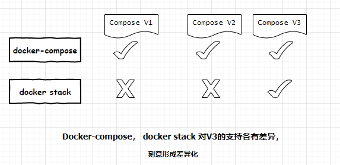

# docker-compose、docker stack前世今生

## 回顾

《docker-compose真香》详细讲述docker-compose容器编排工具的用法，实际上容器编排yml文件在进化到版本3的时候，docker-compose更像是被定义为 适用于开发、测试环境的容器编排工具。

另外Docker引擎在1.12 版本集成了Docker Swarm, 内置新的容器编排工具docker stack，

- 使用方式雷同：都使用yml 容器编排定义文件

```sh
docker-compose -f docker-compose up

docker stack deploy -c docker-compose.yml somestackname
```

- 作用大体相同： 两机制都能操纵 compose.yml文件中定义的 services、volumes 、networks资源。

另外由于docker swarm内置，所以可不需要安装docker-compose 工具

但是为什么会引入新的docker stack 容器编排技术呢？ docker-compose与docker stack除了语法，还有什么不同？

## 两者差异



举例如下：

- docker stack 不支持 compose file中的“build”指令， 相比之下docker-compose可现场创建镜像，更适合迭代开发、测试和 快速验证原型

```text
      This “build” option is ignored when deploying a stack in swarm mode with a (version 3) Compose file. The docker stack command accepts only pre-built images.
```

- docker-compose 不支持 compos版本3中 deploy配置节(定义适用于生产部署的配置)， 这个deploy配置节专属于docker stack.
  - compose v2依旧有 restart指令， 对于生产部署支持不足、杯水车薪。
  - docker stack 强化了service的概念：服务可理解为发布到生产环境时某组容器的预期状态 

## 前世

docker-compose是一个Python项目。 最初有一个名叫fig的Python项目能够解析 fig.yml——>启动docker 容器堆栈，很多人都很喜欢这个工具，尤其是github上fork 这个项目的forkers， 这个工具慢慢产品化并被改名为docker-compose，

但是这始终是一个Python工具，作用在Docker引擎的顶层。

在内部，它使用Docker API根据规范启动容器，仍然必须单独安装docker-compose工具包才能将其与Docker一起使用。

docker stack的能力来源自docker引擎原生支持，你不需要安装额外工具包去启动docker容器堆栈（docker stack 是docker swarm的一部分）。

docker stack 支持与docker-compose 相似能力， 但是在Docker引擎内Go语言环境中运行的， 在使用docker stack命令之前你还必须创建一个swarm机器（一般情况下这也不是问题）。

docker stack 不支持版本2规范编写的compose.yml文件，必须使用最新的V3 版本。docker-compose工具依然可以处理版本2，3（如上所述，会忽略掉不再适用于该工具的某些指令）。

## 今生

可以渐渐理解两者差异的趋势：

- docker-compose 更像是被定义为单机容器编排工具；

- docker stack被定义为适用于生产环境的编排工具，强化了（ 复制集、 容器重启策略、回滚策略、服务更新策略 ）等生产特性。

为什么docker公司要强化docker stack， 因为docker stack是进阶docker swarm 的必经之路

docker stack 可认为是单机上的负载均衡部署； 可认为是多节点集群部署（docker swarm）的特例。

画外音： 希望开发者上手docker stack用于生产部署，自然过渡到docker swarm， 不然我跟 kubernetes怎么竞争？

## 结论

docker-compose、docker stack工具命令都可以使用版本3编写的docker-compose.yml 文件上，版本3之前的docker-compose.yml 文件可继续使用docker-compose工具，

如果你仅需要一个能操作多个容器的工具，依旧可以使用docker-compose工具。

因为docker stack几乎能做docker-compose所有的事情 （生产部署docker stack表现还更好），如果你打算使用docker swarm集群编排，可尝试迁移到docker stack。

修改为适用于docker satck的 compose V3文件，不会花很多时间。

## 原文

[原文链接](https://www.cnblogs.com/JulianHuang/p/11599170.html)